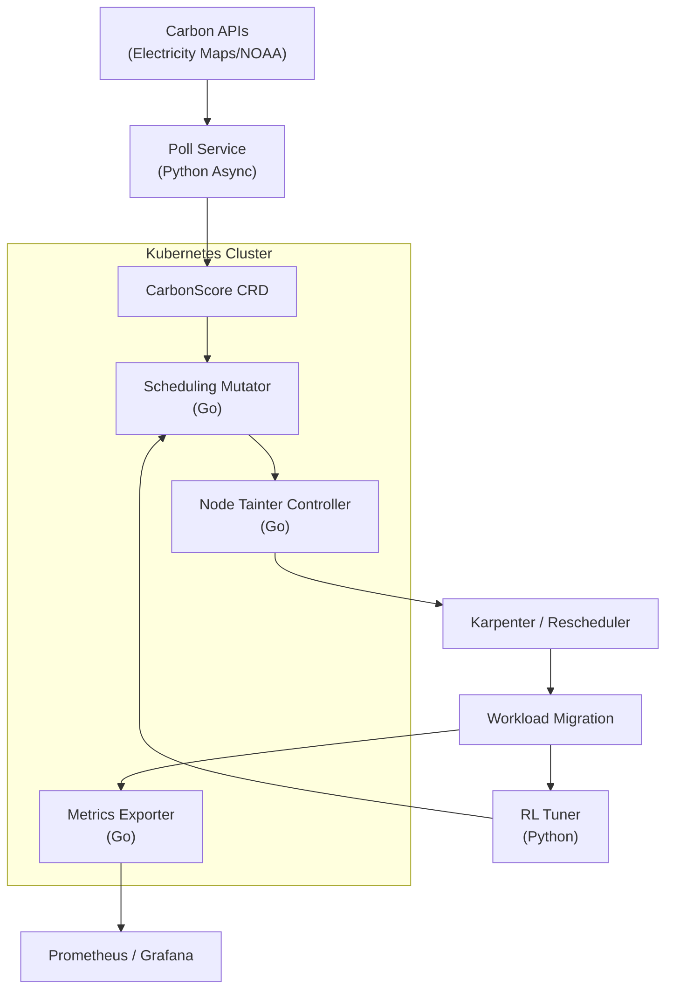

# Carbon-Kube (Redesigned, Code Included)

This repository is a **full reference implementation** of the redesigned
Carbon-Kube project described in your design document:

- Go-based scheduler mutator + metrics + (stub) taint controller
- Python async poller
- Python RL tuner
- Kubernetes CRD + Helm chart
- Example Grafana dashboard
- AWS CDK skeleton for one-click deployment

It is intentionally kept dependency-light and focuses on clear module
boundaries, so you can:
- Plug in real Katalyst / scheduler APIs
- Swap in a real Kubernetes client for the Go controller
- Fully wire Bazel, gRPC, and protobuf generation

## Layout

- `proto/` — Protocol Buffers for `CarbonScore` and `Config`
- `cmd/poll/` — Python async poller entrypoint
- `poller/` — Python poller library + tests
- `cmd/rl/` — Python RL tuner service entrypoint
- `rl/` — Python RL tuner library + tests
- `cmd/mutator/` — Go mutator entrypoint (demo loop + metrics)
- `cmd/taintcontroller/` — Go node-taint controller entrypoint (stub)
- `cmd/metrics/` — Go metrics-only exporter
- `pkg/emission/` — Go library: types, score client, mutator, metrics, controller
- `deploy/helm/` — Helm chart and CRD templates
- `k8s/` — Standalone CRD manifest (quick apply)
- `grafana/` — Example Grafana dashboard JSON
- `deploy/cdk/` — AWS CDK skeleton for EKS + Helm

## High-Level Flow (Mermaid)



## Local Development

This repo is self-contained enough to run unit tests and the demo
binaries without Kubernetes:

```bash
# Go tests
go test ./pkg/...

# Python tests
pytest -q
```

You can then iterate:
- Replace stubbed I/O (prints) with real Kubernetes client calls
- Wire to your existing Arcee / Katalyst ecosystem
- Expand Bazel config to your org standards

## License

Apache 2.0 (see `LICENSE`).
