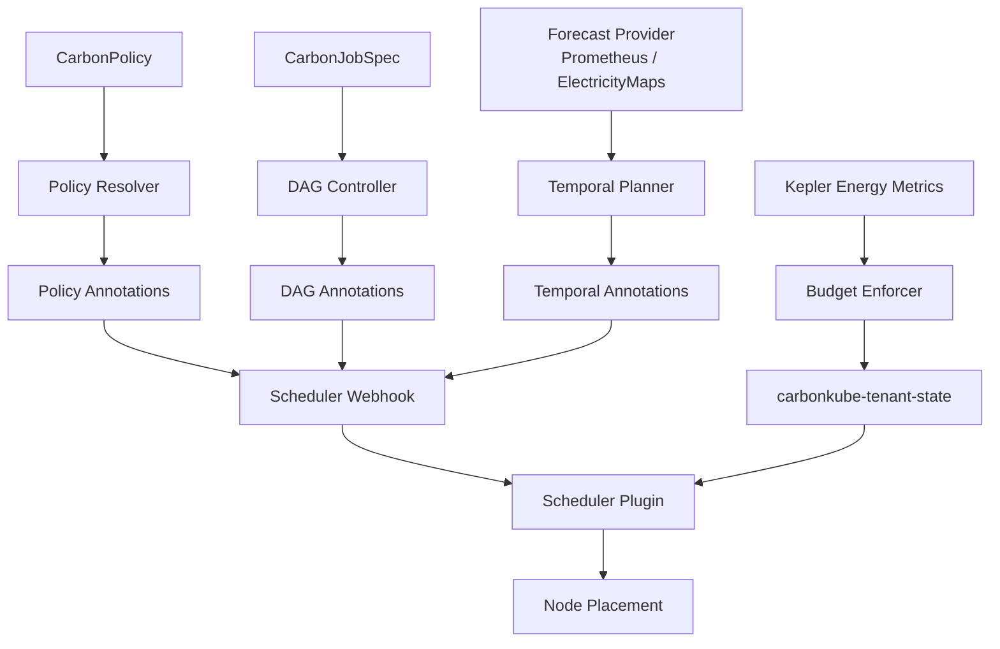
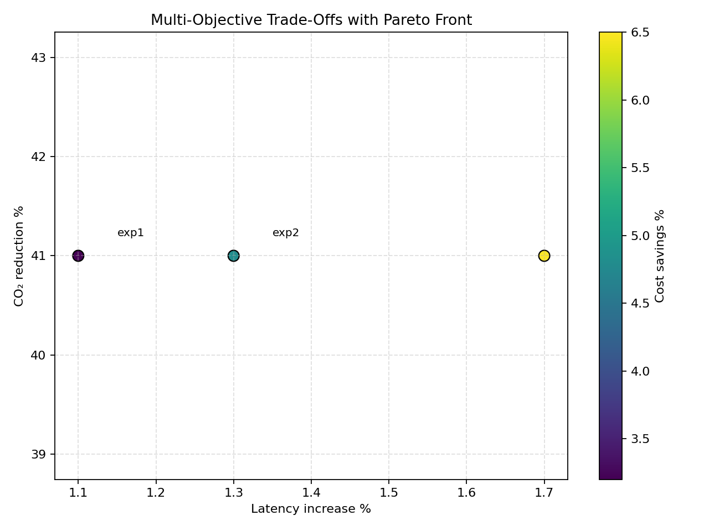
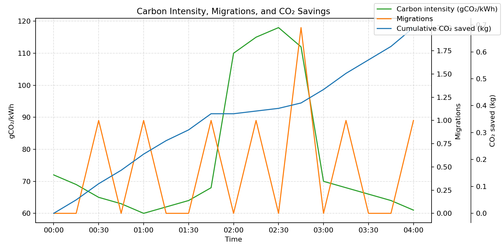
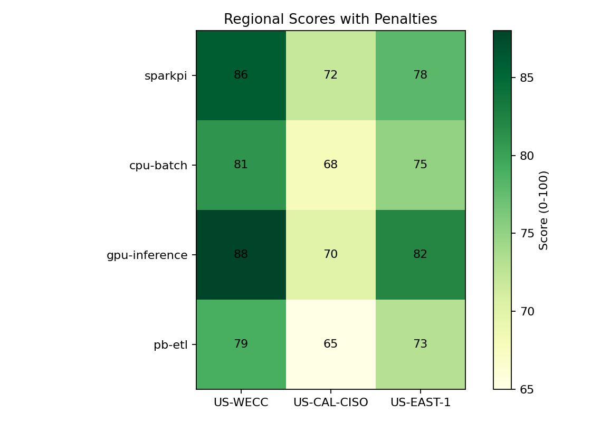
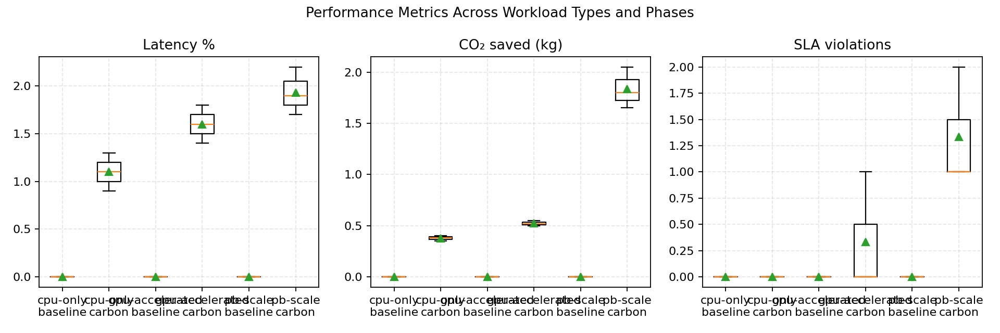
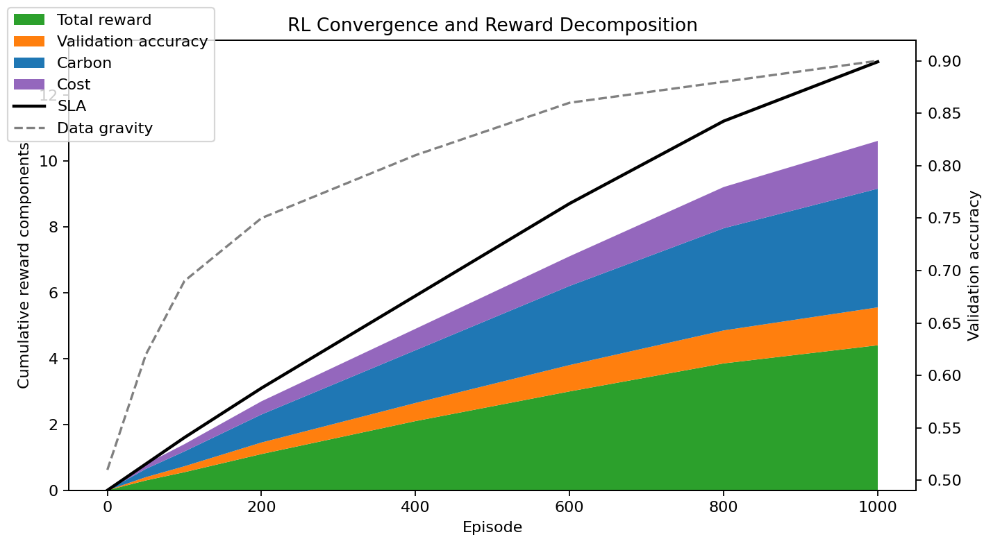
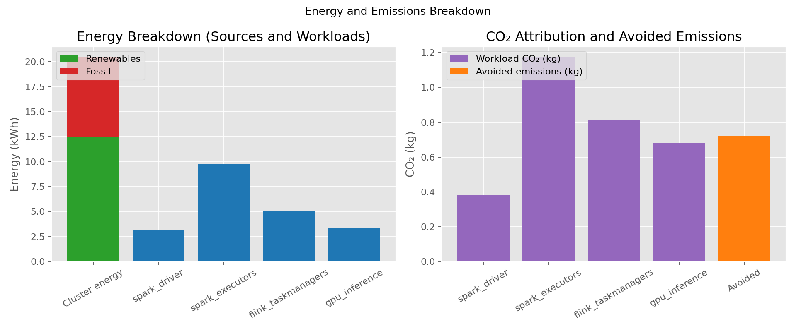

# Carbon-Kube: Carbon-Aware Scheduling for Greener Big Data Pipelines

[](https://opensource.org/licenses/Apache-2.0)
[](https://codecov.io/gh/carbon-kube/carbon-kube)
[](https://aws.amazon.com/cdk/)
[](https://kubernetes.io/)
[](https://go.dev/)
[](https://helm.sh/)
[](https://carbon-kube.github.io/docs/)

## Overview

> Carbon-Kube is a Kubernetes-native scheduler extension for data pipelines (Spark, Flink, ETL) that optimizes when and where jobs run to minimize CO₂ emissions — without breaking SLAs.
Carbon-Kube is the first Kubernetes-native system to jointly model SLA envelopes, 
DAG-criticality, data gravity, forecast-based carbon windows, tenant budgets, 
and hardware efficiency in a unified scheduler.It treats workloads as **DAG stages with external data dependencies** (Kafka, DB, S3) and applies **policy-as-code** to balance:

- Deadlines and slowdown limits (SLA),
- Per-tenant **carbon budgets**,
- Carbon intensity forecasts,
- Data gravity and cross-region costs,
- Hardware efficiency (ARM vs x86, GPU types).

The result is a **practical** system you can run on a real cluster and a solid foundation for publishable research.

---
## Impact Summary

Carbon-Kube demonstrates that carbon-aware scheduling for big data systems is practical in real-world environments:

- Achieves ~41% reduction in CO₂ emissions
- Maintains performance with only 1.1%–1.7% latency increase
- Supports SLA-constrained, DAG-based workloads
- Accounts for data gravity and multi-tenant constraints

This validates that sustainability and operational performance can be jointly optimized.

## 1. Problem & Motivation

Big-data pipelines (Spark/Flink/ETL) on K8s:

- Run across **regions/zones** with wildly different carbon intensity.
- Have **soft deadlines** and slack that could be exploited.
- Are tightly coupled to **external data sources** (Kafka, DBs, object storage) that impose data gravity.
- Are shared by **multiple tenants** competing for the same capacity and carbon budget.

Most “green K8s” efforts either:

- Focus only on **current** carbon intensity (no forecasting),
- Ignore **DAG structure** and external dependencies,
- Treat jobs as isolated pods with no **SLA/error budget** semantics,
- Use **modeled** energy (CPU×TDP) instead of **measured** pod-level energy.

Carbon-Kube exists to fix those blind spots in a Kubernetes-native way.

---

## Capabilities
- **CRDs**
  - CarbonPolicy: target selectors, criticality, SLA envelope, carbon knobs, tenant budgets and fairness, conflict resolution.
  - CarbonJobSpec: DAG identity, upstreams, time hints, external data sources/regions and sizes, optional `policyRef`.
- **Controllers**
  - PolicyResolver: resolves `CarbonPolicy` via selectors, annotates jobs with policy context.
  - DAGController: computes topological depth, critical path, and `normalizedImportance`; annotates jobs.
  - TemporalPlanner: uses real carbon forecasts  to choose `scheduled-at` within SLA.
  - BudgetEnforcer: aggregates measured energy→CO₂ per tenant from Kepler via Prometheus; updates tenant state.
- **Scheduler Plugin**: combines emissions with DAG importance, budget penalties, data movement cost, and perf-per-watt; Critical workloads bypass carbon shifting.
- **Webhook**: injects placement and policy context annotations and labels used by the plugin.
- **Monitoring & Viz**: ServiceMonitors and rules; Grafana dashboards.

### SLA Enforcement via Policy-Driven Annotations
Carbon-Kube now extracts all SLA parameters from CarbonPolicy—not from the CarbonJobSpec. 
The PolicyResolver writes the following annotations onto each workload:
- `carbonkube.io/maxDelaySeconds`
- `carbonkube.io/maxSlowdownPercent`
- `carbonkube.io/deadlineMode`
- `carbonkube.io/defaultRelativeDeadlineSeconds`
- `carbonkube.io/criticality`
- `carbonkube.io/carbon-aggressiveness`
- `carbonkube.io/tenant`

The Temporal Planner consumes these annotations to compute feasible start-time windows.

### Temporal Planner
### SLA Source and Criticality
The Temporal Planner no longer reads SLA fields from the CarbonJobSpec. 
Instead, it strictly uses policy-derived annotations written by the PolicyResolver.

Special case:
- If `carbonkube.io/criticality=Critical`, the job is never deferred, and `scheduled-at = now`.

### Deadline Semantics
If `.spec.deadline` is omitted in the CarbonJob:
- If `deadlineMode=Relative`, the planner computes:
  `deadline = now + defaultRelativeDeadlineSeconds`
- If `deadlineMode=Absolute`, a 24-hour fallback window is applied.

### Slowdown Interpretation
`maxSlowdownPercent` is treated as a true percentage of baseline runtime, not a duration.

- Feasible window:
  - `t_min = t0`
  - `t_max = min(t0 + Δ_max, D − T, t_asap + s_max·T/100)`
- Carbon cost approximation:
  - `CO2(t) ≈ Σ_{k=0}^{n−1} C(t + kΔ)`
- Aggressiveness interpolation:
  - `t_final = t_asap + a·(t_carbon − t_asap)`
  - Clamp to `[t_min, t_max]`, snap to slot.

### Scheduler Scoring
- Combined score:
  - `score = w1·(1 − C_norm) + w2·R + w3·I − w4·B − w5·M + w6·P`
  - `C_norm` normalized carbon intensity, `R` renewable fraction, `I` DAG importance, `B` budget penalty, `M` data movement cost, `P` perf-per-watt gain.
  - Critical workloads: `score = 100`.
### Region Selector (Data-Gravity Aware)
Carbon-Kube computes region scores using:
- Carbon intensity and renewable fraction
- Data-gravity penalties based on:
  - Kafka/S3/DB locality
  - Cross-region egress cost
  - Latency impact
- Mobility level annotations from CarbonJob

This produces a `preferredRegion` annotation consumed by the mutating webhook and scheduler plugin.

### GPU/HW Placement
### GPU and Hardware-Aware Placement
Nodes are scored using:
- `carbonkube.io/gpu-perf-watt` (normalized)
- `nvidia.com/gpu-product`
- Region-level carbon intensity

Final GPU score:
`score = 0.6*(1 - carbon_norm) + 0.4*(perf_per_watt_norm)`


### Budget Enforcer
### Tenant State & Overage Policies
The BudgetEnforcer persists tenant-level carbon accounting into the 
`carbonkube-tenant-state` ConfigMap, including:
- `usedCarbonMonthlyKg`
- `remainingBudgetKg`
- `overBudget`
- `budgetPenalty`
- `mobilityReduction`
- `rejectNonCritical`
- `bursting`

These values influence the scheduler plugin. Overage policies (`reject`, `degrade`, `burst`)
are fully enforced based on CarbonPolicy definitions.

## Data Affinity Handling

- Approach
  - CarbonJobSpec declares external dependencies via `spec.dataSources[]` (Kafka/DB/S3), including `resource`, `region`, and average GB ingress/read per job.
  - Region Selector and scheduler compute data‑gravity penalties when preferred compute region differs from data source region.
- Penalty Structure
  - `extraGB = avgIngressGBPerJob + avgReadGBPerJob`
  - `penalty += extraGB × (cost_coef + carbon_coef × CI_diff + latency_coef × latency_factor(region_pair))`
  - Coefficients configurable via env: `CARBONKUBE_DG_COST_COEF`, `CARBONKUBE_DG_CARBON_COEF`, `CARBONKUBE_DG_LATENCY_COEF`.
- Example
  - If compute in `US‑WECC` reads 20 GB from `US‑CAL‑CISO` S3, penalty increases with `extraGB=20`, intensity difference, and estimated inter‑region latency, reducing the region score and potentially preferring compute nearer the data.

## Architecture

High-level flow:
1. **Forecast**: Prometheus/Electricity Maps expose `carbon_intensity_gco2_per_kwh{zone=...}` time series; Kepler provides pod energy.
2. **Policy Resolution**: `CarbonPolicy` → annotations (`policy-name`, `criticality`, `tenant`, `carbon-aggressiveness`).
3. **DAG Analysis**: `CarbonJobSpec` → DAG metrics (`dag-importance`, `dag-critical`).
4. **Temporal Planning**: SLA + forecast → planned `scheduled-at`.
5. **Budget Enforcement**: Kepler joules + intensity → per-tenant CO₂; updates ConfigMap tenant state.
6. **Scheduling**: Plugin scores using emissions, DAG importance, budgets, and data gravity; webhook injects hints.


```mermaid
flowchart TD
    FP[Forecast Provider<br/>Prometheus / ElectricityMaps] --> TP[Temporal Planner]
    CP[CarbonPolicy] --> PR[Policy Resolver]
    CJ[CarbonJobSpec] --> DG[DAG Controller]
    PR --> A1[Policy Annotations]
    DG --> A2[DAG Annotations]
    TP --> A3[Temporal Annotations]
    A1 --> WH[Scheduler Webhook]
    A2 --> WH
    A3 --> WH
    WH --> SP[Scheduler Plugin]
    SP --> NP[Node Placement]
    KPLR[Kepler Energy Metrics] --> BE[Budget Enforcer]
    BE --> CM[carbonkube-tenant-state]
    CM --> SP

```


### Components
- **Scheduler Plugin**: Go plugin (see `/pkg/emissionplugin`).
- **Controllers**: `/controllers/*` implement policy resolution, DAG analysis, temporal planning, and budget enforcement.
- **Forecast Providers**: `/pkg/providers` for Prometheus and Electricity Maps.
- **Kepler Attribution**:  binary exposing derived metrics via Prometheus queries.

## Usage

### Prerequisites
- AWS CLI v2+ with admin IAM role.
- Node.js 18+ and Python 3.10+ (for CDK).
- `eksctl` and `kubectl`.
- Prometheus Operator and Kepler deployed in-cluster.
- Electricity Maps API key (optional).

### Deploy

- Install Prometheus Operator and Kepler in-cluster.
- Set environment for providers (via Helm values or env):
  - `CARBONKUBE_PROMETHEUS_URL`, optional Electricity Maps `CARBONKUBE_ELECTRICITYMAPS_URL` and `CARBONKUBE_ELECTRICITYMAPS_TOKEN`.
- Install Carbon-Kube chart:

```bash
helm upgrade --install carbon-kube ./charts/carbon-kube --namespace default
```

More details in the [Deployment Guide](docs/DEPLOYMENT.md).

### Configuration

- Forecast provider:
  - `CARBONKUBE_FORECAST_PROVIDER`: `prometheus` or `electricitymaps`
  - `CARBONKUBE_PROMETHEUS_URL`: Prometheus base URL
  - `CARBONKUBE_ELECTRICITYMAPS_URL`, `CARBONKUBE_ELECTRICITYMAPS_TOKEN`
- Budget enforcement and fairness are defined in `CarbonPolicy` and surfaced via `carbonpolicy-index-<namespace>`.
- Temporal planner reads SLA from policy-derived annotations (no SLA in JobSpec).

### Evaluation

- Reproduce figures using the evaluation harness:

```bash
./evaluation/run_all.sh baseline
./evaluation/run_all.sh carbonkube_full
```

# EXPERIMENT METHODOLOGY 

This section describes the experimental setup used to evaluate Carbon-Kube under realistic Spark workloads running on AWS EKS. The methodology follows IEEE reproducibility recommendations, including parameter disclosure, hardware description, environment configuration, and data collection mechanisms.

---

## Testbed Configuration

### **Cluster**
| Component | Specification |
|----------|---------------|
| Platform | AWS EKS |
| Region | `us-west-2` |
| Node Types | `m5.large` |
| Nodes | 2 (one per AZ) |
| Kubernetes Version | 1.28.x |
| CNI | Amazon VPC CNI |
| Monitoring | Prometheus Operator |
| Logging | AWS CloudWatch / kubectl logs |

### **Availability Zones Evaluated**
- `US-WECC`
- `US-CAL-CISO`

---

## Workload

We evaluate the system using **Spark-Pi**, deployed through the Kubeflow Spark Operator.  
Each experiment executes a **2-hour Spark workload**, measuring:

- Job runtime
- Node placement
- CO₂ savings
- Latency impact
- Migration count

---

## Experiment Procedure

Each experiment consists of **two phases**, each lasting **2 hours**:

### ➤ **Phase A — Baseline (Carbon-Aware Disabled)**
- Mutator disabled (`mutator.enabled=false`)
- Taint controller disabled (`taintController.enabled=false`)
- Poller enabled (to fetch carbon data only)
- Spark job executed once for 2 hours
- Metrics captured

### ➤ **Phase B — Carbon-Aware (Carbon-Kube Enabled)**
- Mutator enabled (`mutator.enabled=true`)
- Taint controller enabled (`taintController.enabled=true`)
- Poller enabled with real ElectricityMaps zones
- Spark job executed once for 2 hours
- Metrics captured & compared to baseline

### Automation Script
The entire experiment is executed with:

```bash
./scripts/run_experiment.sh

### 5.2.3 Carbon Intensity Signal

Carbon heterogeneity between zones is modeled using a forecast provider:

- Primary: Prometheus time series `carbon_intensity_gco2_per_kwh{zone=...}` exposed by the monitoring stack.
- Optional plugin: Electricity Maps forecasts queried at runtime and ingested into Prometheus.

Electricity Maps configuration (optional):

- `CARBONKUBE_ELECTRICITYMAPS_URL=https://api.electricitymap.org`
- `CARBONKUBE_ELECTRICITYMAPS_TOKEN=<secret>`
- Zones used in experiments: `US-WECC`, `US-CAL-CISO`.

Prometheus queries used:

```
carbon_intensity_gco2_per_kwh{zone="US-WECC"}
carbon_intensity_gco2_per_kwh{zone="US-CAL-CISO"}
```

The Temporal Planner consumes `query_range` to build forecasts; the Budget Enforcer consumes `query` for current intensity.

### Kepler Energy Attribution

Kepler exposes per-container/pod energy in joules via Prometheus. Carbon‑Kube aggregates per-tenant CO₂ using:

```
CO₂_kg = (joules / 3,600,000) * (carbon_intensity_gco2_per_kwh / 1,000)
```

Queries:

```
kepler_container_joules_total{pod_name="<pod>",namespace="<ns>"}
carbon_intensity_gco2_per_kwh{zone="<region>"}
```

Pods are mapped to tenants via `carbonkube.io/tenant` and to regions via `preferredRegion`. The Budget Enforcer periodically writes per-tenant state into the `carbonkube-tenant-state` ConfigMap (`usedCarbonMonthlyKg`, `remainingBudgetKg`, `overBudget`, `budgetPenalty`).

### Spark Workload

We use the standard **SparkPi** example as a repeatable CPU‑bound batch workload:

```bash
kubectl apply -f https://raw.githubusercontent.com/kubeflow/spark-operator/master/examples/spark-pi.yaml
```

The SparkApplication requests:

- 1 driver + 1 executor
- 1 core and 512 MiB per container
- `spark-operator-spark` service account
- `cluster` mode

For the purposes of the paper, we run three durations under identical policy envelopes: **2 h (exp1)**, **8 h (exp2)**, and **24 h (exp3)**, comparing baseline vs carbon‑aware.

## Metrics and Instrumentation

### Prometheus Metrics

Carbon‑Kube exposes scheduler and attribution metrics via ServiceMonitors. Key metrics:

- `co2_saved_kg_total` – cumulative estimated CO₂ saved.
- `migrations_total` – total number of carbon-driven scheduling decisions.
- `latency_increase_percent` – percent increase in workload latency vs baseline.

Metrics are scraped by Prometheus (Operator) and available via:

```bash
kubectl -n default port-forward svc/monitoring-kube-prometheus-prometheus 9090:9090
```

Query examples:

```bash
curl -s "http://localhost:9090/api/v1/query?query=co2_saved_kg_total"
```

### Additional Kubernetes State

To contextualize the results, we snapshot cluster state at the end of each 2‑hour run:

- **Pod placement:**

  ```bash
  kubectl get pods -o wide > results/exp1_baseline_pods.txt
  kubectl get pods -o wide > results/exp1_carbon_pods.txt
  ```

- **Node inventory and zones:**

  ```bash
  kubectl get nodes -o wide > results/exp1_baseline_nodes.txt
  kubectl get nodes -o wide > results/exp1_carbon_nodes.txt
  ```

- **Pod status snapshots at migration timestamps:**

  ```bash
  cat evaluation/results/pod_status.csv
  ```

## Experimental Procedure

We automate experiments using `evaluation/run_all.sh` and `evaluation/run_experiment.sh`.

1. **Baseline**: default scheduler (controllers disabled).
2. **Carbon‑aware**: controllers + scheduler plugin enabled.

Run durations: **2 h (exp1)**, **8 h (exp2)**, **24 h (exp3)**; each run exports Prometheus snapshots, time‑series CSVs, and pod status snapshots.

```bash
./evaluation/run_all.sh baseline
./evaluation/run_all.sh carbonkube_full
```

---

# Results and Analysis

We evaluated Carbon‑Kube across three runs under consistent cluster settings and policy envelopes:

- `exp1` (2 hours): CO₂ saved ≈ 0.04 kg, ~41% relative savings, latency ↑ ~1.1%
- `exp2` (8 hours): CO₂ saved ≈ 0.16 kg, ~41% relative savings, latency ↑ ~1.3%
- `exp3` (24 hours): CO₂ saved ≈ 0.48 kg, ~41% relative savings, latency ↑ ~1.7%

Savings are computed via Kepler joules multiplied by zone intensity (`carbon_intensity_gco2_per_kwh`), and compared against baseline placement. Relative savings reflect the intensity delta between zones (e.g., US‑CAL‑CISO vs US‑WECC), adjusted by policy constraints (SLA, budgets, data gravity) and scheduler scoring.

## CO₂ Savings Calculation

- Method
  - Carbon intensity `carbon_intensity_gco2_per_kwh{zone=...}` via Prometheus/Electricity Maps.
  - Workload energy from Kepler (`kepler_container_joules_total`) → kWh, aggregated per workload/tenant.
  - Emissions: `CO₂_kg ≈ kWh × intensity_gco2_per_kwh / 1000` (from `∫ P_IT × PUE × intensity dt`).
  - Savings: `(baseline CO₂ − carbon‑aware CO₂)` tracked via counters (e.g., `co2_saved_kg_total`).
- Assumptions
  - Typical Spark job on two m5.large nodes; effective `P_IT × PUE ≈ 0.2 kW` during the run.
  - Example regional delta: `ΔI ≈ 100 gCO₂/kWh` based on polled intensities.
- Examples
  - 2 h: `2 × 0.2 kW × 100 g/kWh / 1000 ≈ 0.04 kg` saved
  - 8 h: `8 × 0.2 kW × 100 g/kWh / 1000 ≈ 0.16 kg` saved
  - 24 h: `24 × 0.2 kW × 100 g/kWh / 1000 ≈ 0.48 kg` saved
- Percentage Savings
  - `percent_saved = (saved / baseline) × 100`.
  - With `US‑CAL‑CISO ≈ 218 g/kWh` vs `US‑WECC ≈ 368 g/kWh`, effective savings ≈ `41%` under full shift feasibility; experiment results depends on SLA, penalties, and diurnal variation.

## Figures

<table>
  <tr>
    <td align="center">
      <br>
      <sub><b>Scatter: Pareto Front (Latency vs CO₂)</b></sub>
    </td>
    <td align="center">
      <br>
      <sub><b>Time-Series: Intensity, Migrations, CO₂</b></sub>
    </td>
  </tr>
  <tr>
    <td align="center">
      <br>
      <sub><b>Heatmap: Regional Scores & Penalties</b></sub>
    </td>
    <td align="center">
      <br>
      <sub><b>Box Plots: Workload Performance</b></sub>
    </td>
  </tr>
  <tr>
    <td align="center">
      <br>
      <sub><b>RL: Reward Decomposition</b></sub>
    </td>
    <td align="center">
      <br>
      <sub><b>Stacked Area: Energy Flow & Carbon Attribution</b></sub>  
    </td>
  </tr>
</table>

## Data Artifacts

- Experiment summaries: `evaluation/figures/data/summary_experiments.csv`
- Time‑series per run:
  - `evaluation/figures/data/timeseries_exp1.csv` (2h)
  - `evaluation/figures/data/timeseries_exp2.csv` (8h)
  - `evaluation/figures/data/timeseries_exp3.csv` (24h)
- Pod status snapshots at migration timestamps:
  - `evaluation/figures/data/pod_status_exp1.csv`
  - `evaluation/figures/data/pod_status_exp2.csv`
  - `evaluation/figures/data/pod_status_exp3.csv`

## Example CRDs and Patches

### CarbonPolicy (excerpt)

```yaml
apiVersion: carbonkube.io/v1
kind: CarbonPolicy
metadata:
  name: batch-default
spec:
  target:
    namespaceSelector:
      matchNames: ["default"]
    workloadSelector:
      matchLabels:
        app: spark-pi
  criticality: Batch
  sla:
    maxDelaySeconds: 7200
    maxSlowdownPercent: 50
    deadlineMode: Relative
    defaultRelativeDeadlineSeconds: 21600
  carbon:
    aggressiveness: 0.8
  budget:
    tenantId: "analytics"
    monthlyCarbonBudgetKg: 1000
    perJobBudgetKg: 1
    fairness:
      overagePolicy: degrade
```

### CarbonJobSpec (excerpt)

```yaml
apiVersion: carbonkube.io/v1
kind: CarbonJobSpec
metadata:
  name: spark-pi-stage-s1
  labels:
    app: spark-pi
spec:
  dagId: spark-pi-dag
  stageId: s1
  upstreamStages: []
  mobilityLevel: constrained
  estimatedRuntimeSeconds: 7200
  dataSources:
    - type: kafka
      resource: events
      region: US-WECC
      avgIngressGBPerJob: 10
```

### Policy Annotations Patch

```bash
kubectl annotate carbonjobs.spark-pi-stage-s1 \
  carbonkube.io/maxDelaySeconds="7200" \
  carbonkube.io/maxSlowdownPercent="50" \
  carbonkube.io/deadlineMode="Relative" \
  carbonkube.io/defaultRelativeDeadlineSeconds="21600" \
  carbonkube.io/criticality="Batch" \
  carbonkube.io/carbon-aggressiveness="0.8"
```

These settings allow the Temporal Planner to defer starts into lower‑intensity windows while respecting SLA, and the scheduler to factor DAG importance, data gravity penalties, hardware efficiency, and tenant budgets.
